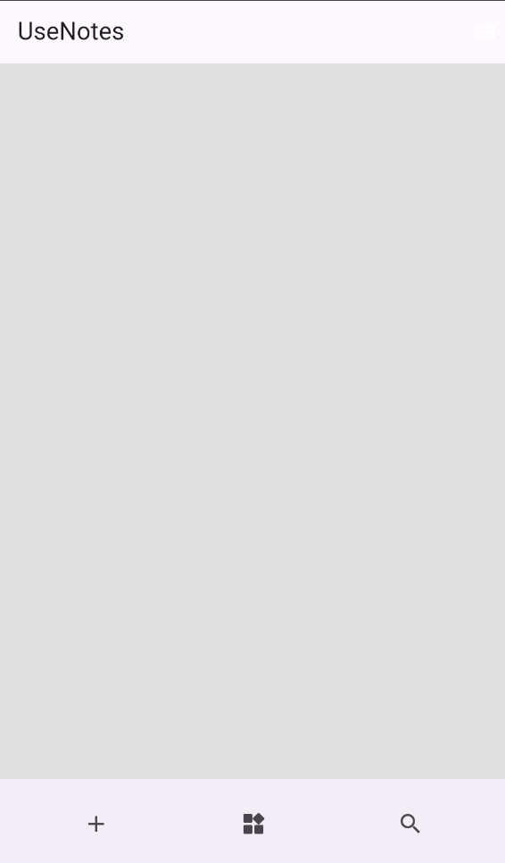
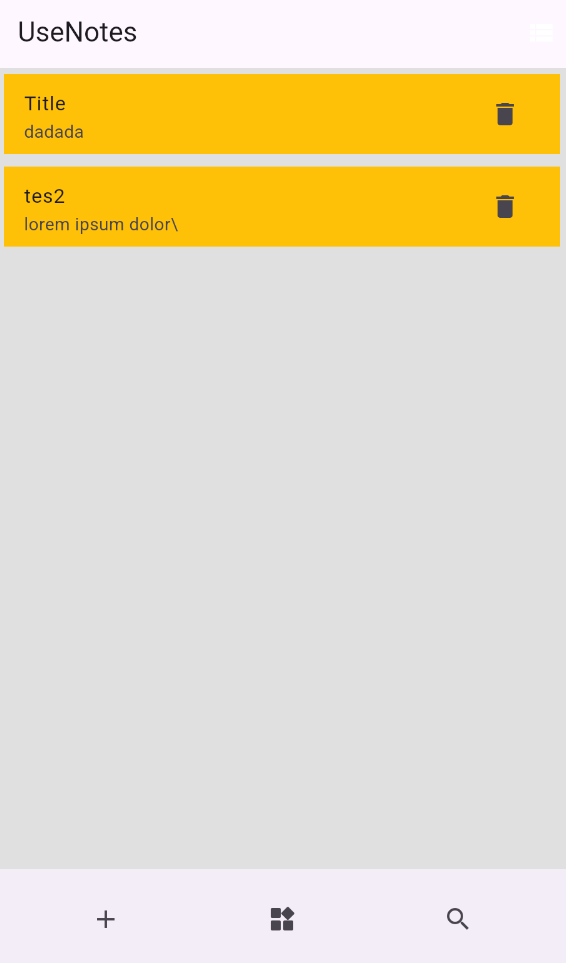
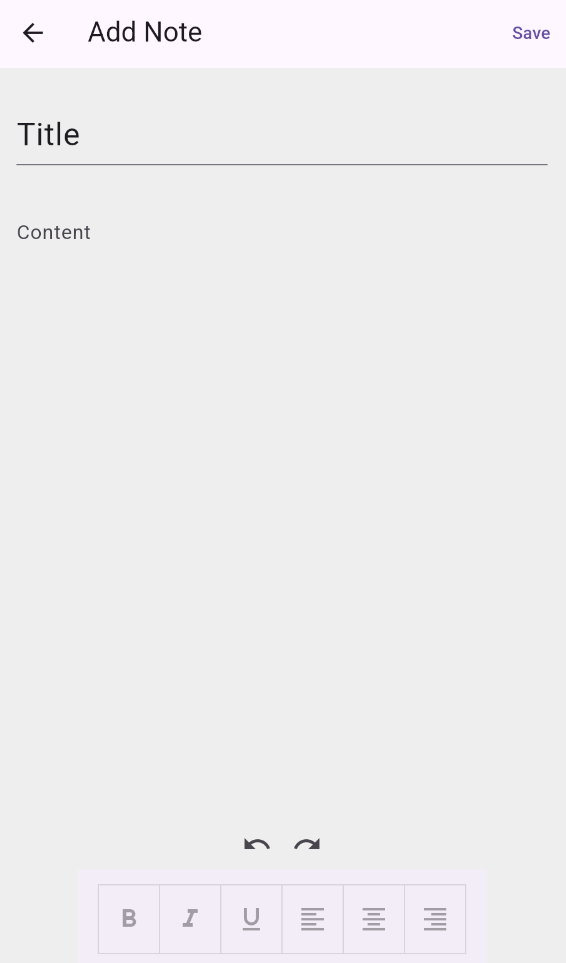
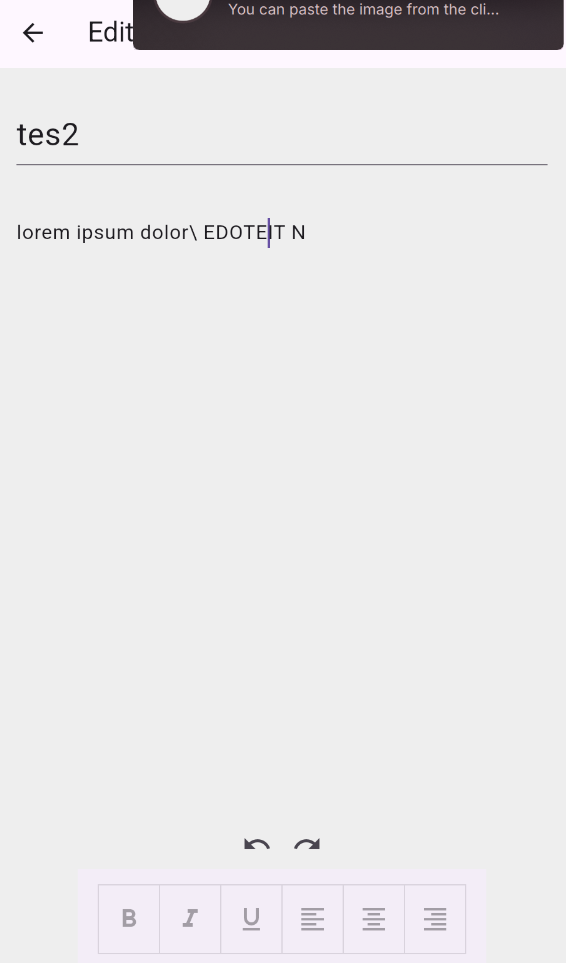
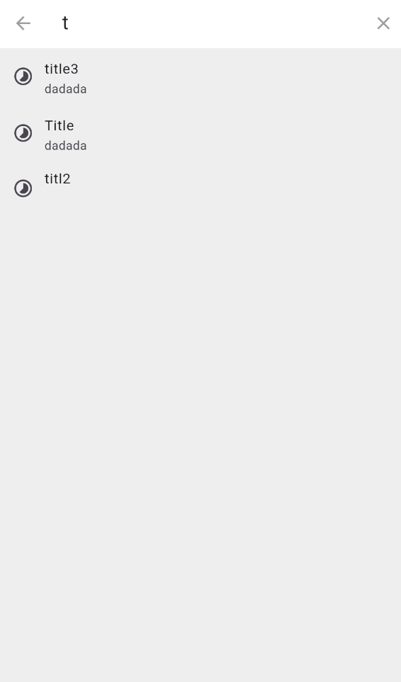
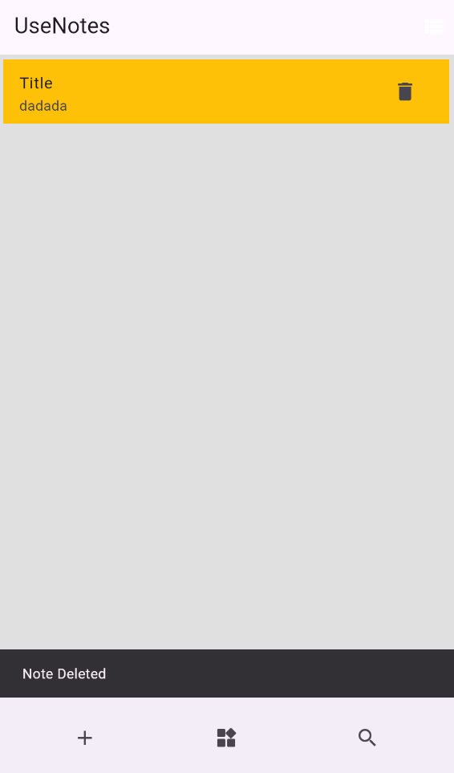

# UseNote

UseNote is a Flutter-based note-taking application designed for quickly writing, organizing, searching, and managing personal notes. The app focuses on a clean mobile experience with local-first data storage, simple navigation, and flexible note viewing modes.

## Overview

UseNote allows users to create notes with a title and content, browse saved notes in either list or grid layout, search existing notes, edit note content, and delete notes when they are no longer needed. Notes are stored locally on the device using Hive, making the app lightweight and usable without a remote backend.

## Features

- Create notes with title and content fields.
- Edit existing notes from the home or search screen.
- Delete notes directly from list or grid items.
- Search notes by title or content.
- Switch between list view and grid view.
- Persist notes locally using Hive.
- Persist view preferences locally.
- Navigate between screens using GetX routing and bindings.

## Screenshots

| Home | Empty State | Create Note |
| --- | --- | --- |
|  |  |  |

| Edit Note | Search | Delete Note |
| --- | --- | --- |
|  |  |  |

## Tech Stack

- **Flutter** for cross-platform application development.
- **Dart** as the primary programming language.
- **GetX** for routing, dependency binding, and state management.
- **Hive** and **Hive Flutter** for local NoSQL data persistence.
- **UUID** for generating unique note identifiers.
- **Flutter Staggered Grid View** for grid-based note presentation.

## Project Structure

```text
lib/
|-- config/
|   |-- constant/
|   |-- router/
|   `-- theme/
|-- logic/
|   `-- getx/
|       |-- binding/
|       `-- controller/
|-- services/
|   `-- model/
`-- ui/
    `-- screens/
        |-- add_note_screen/
        |-- edit_note_screen/
        |-- home_screen/
        |-- search_screen/
        `-- settings_screen/
```

## Getting Started

### Prerequisites

Make sure the following tools are installed:

- Flutter SDK
- Dart SDK
- Android Studio or Visual Studio Code
- Android emulator, iOS simulator, or a physical device

This project is configured with the Dart SDK constraint:

```yaml
sdk: ">=2.12.0 <3.0.0"
```

Use a Flutter version that supports this Dart SDK range.

### Installation

Clone the repository and install dependencies:

```bash
git clone <repository-url>
cd UseNote
flutter pub get
```

If generated Hive model files need to be rebuilt, run:

```bash
flutter pub run build_runner build
```

### Running the App

Run the application on a connected device or emulator:

```bash
flutter run
```

### Running Tests

Run the Flutter test suite:

```bash
flutter test
```

## Local Storage

UseNote stores note data locally using Hive. The main note box is initialized when the application starts:

```dart
await Hive.openBox<Note>('note_inventory');
```

The app also stores the preferred home layout mode in a separate Hive box:

```dart
await Hive.openBox<bool>('is_list_view');
```

## Core Workflow

1. The app starts from the home screen.
2. Users can create a new note from the bottom navigation action.
3. Saved notes are shown in list or grid view.
4. Tapping a note opens the edit screen.
5. The search action filters notes by title and content.
6. Delete actions remove notes from local storage.

## License

This project is currently provided without a declared license. Add a license file before distributing or publishing the application.
